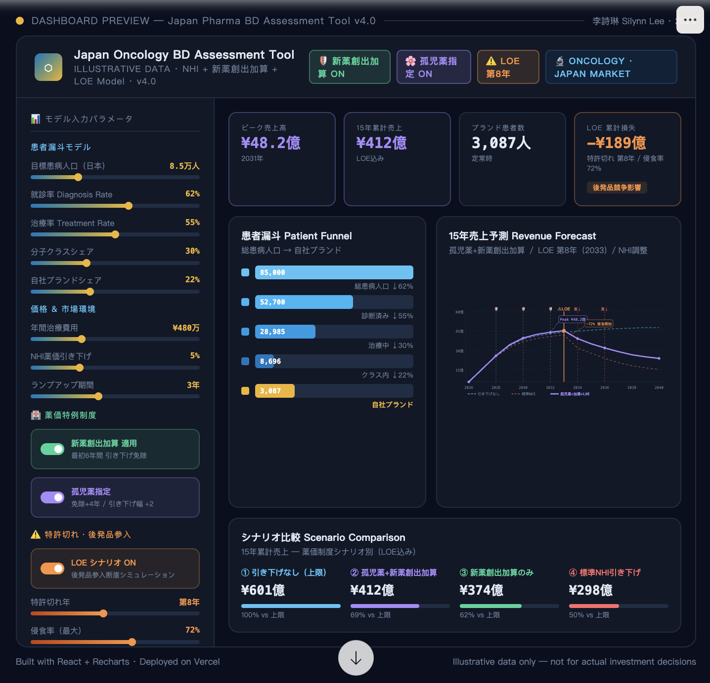

# 🔬 Japan Pharma BD Valuation Tool (Vibe-Coding Edition)

### A Fast-Prototyping Solution for In-licensing & Market Access Assessment

> **An interactive business case modelling tool for pharmaceutical in-licensing (BD) targeting the Japanese oncology market.**
>
> **日本の腫瘍領域における医薬品導入（BD）案件の事業性評価インタラクティブツール。**
>
> **面向日本肿瘤领域药品引入（BD）项目的交互式商业案例测算工具。**

---

## 🌟 项目概述 Overview

本项目是一个为日本制药行业 Business Development (BD) 团队打造的**敏捷估值工具**。它将复杂的"患者漏斗模型"与日本独特的药价下调机制 (NHI Price Cuts) 相结合，通过交互式的动态模拟，帮助决策者在几分钟内完成潜在项目的财务定价和感应度分析。

This project is an **agile valuation tool** built for pharmaceutical BD teams focused on the Japanese market. It combines patient funnel modelling with Japan's unique NHI pricing mechanisms, enabling decision-makers to complete financial assessments and sensitivity analyses within minutes.

本プロジェクトは、日本市場に特化した製薬BD チーム向けの**アジャイル評価ツール**です。患者漏斗モデルと日本独自の薬価引き下げメカニズム（NHI薬価改定）を組み合わせ、意思決定者が数分で財務評価と感応度分析を完了できるよう支援します。

---

## 🎯 业务痛点 The Problem

在传统的制药公司决策中，财务测算通常依赖于笨重的 Excel 表格：

- **不直观** — 非财务背景的高管难以实时理解参数变动对销售峰值的影响
- **响应慢** — 调整一个市场份额（Market Share）或就诊率（Diagnosis Rate）通常需要反复沟通
- **政策脱节** — 日本每两年一次的药价下调逻辑在 Excel 中往往不够透明

In traditional pharma decision-making, financial modelling relies on static Excel spreadsheets: unintuitive for non-finance stakeholders, slow to iterate, and disconnected from Japan-specific pricing policy logic.

従来の製薬企業の意思決定では、財務モデリングは静的なExcelスプレッドシートに依存しており、非財務系ステークホルダーには直感的でなく、反復が遅く、日本固有の薬価ロジックからも乖離していました。

---

## 🛠️ 核心功能 Features

- **动态患者漏斗 Patient Flow** — 从总患病人口到自社品牌使用者的五层逻辑下沉
- **NHI 调价算法** — 自动计算15年药价衰减曲线，含新薬創出加算保护期与孤児薬特例
- **LOE 断崖模拟** — 专利到期后的后发品侵蚀曲线，支持即时/渐进两种模式
- **实时感应度分析** — 热力矩阵展示"就诊率 × 品牌份额"的收益波动
- **金融级 UI** — 基于 2026 年主流审美设计的深色商务仪表盘

---

## 🚀 技术范式 Vibe Coding Methodology

本项目是 **Vibe Coding（意图驱动开发）** 的典型实践。利用 **Claude Sonnet 4.6** 作为"首席工程师"，本人作为"首席构思者"，在极短时间内完成了从业务逻辑建模到全栈代码实现的转化。

This project is a showcase of **Vibe Coding** — intent-driven development using **Claude Sonnet 4.6** as the engineering partner and the author as the domain expert and product owner. Complex pharma BD logic was translated into a full-stack interactive tool through natural language iteration alone.

本プロジェクトは **Vibe Coding（意図駆動開発）** の典型的な実践例です。**Claude Sonnet 4.6** を「チーフエンジニア」として、著者が「チーフ構想者」として、業務ロジックのモデリングからフルスタックコード実装まで、自然言語のみによる反復で実現しました。

- **AI Agent** — Claude Sonnet 4.6 による環境設定・デバッグ・コード生成
- **Rapid Iteration** — 自然言語フィードバックによる UI 微調整と財務ロジック修正
- **Domain-first Design** — 製薬BD専門知識をそのままコードへ変換

---

## 📈 演示 Demo



---

## 🌐 Live Demo

[](https://vercel.com/new/clone?repository-url=https://github.com/YOUR_USERNAME/japan-pharma-bd-tool)

> Replace `YOUR_USERNAME` with your GitHub handle after forking.
> フォーク後、`YOUR_USERNAME` を自分のGitHubユーザー名に置き換えてください。
> Fork 后请将 `YOUR_USERNAME` 替换为你的 GitHub 用户名。

---

## 📋 Table of Contents / 目次 / 目录

- [Overview 项目概述](#-项目概述-overview)
- [The Problem 业务痛点](#-业务痛点-the-problem)
- [Features 核心功能](#-核心功能-features)
- [Vibe Coding Methodology](#-技术范式-vibe-coding-methodology)
- [Demo 演示](#-演示-demo)
- [Background](#background)
- [Japan Pricing Logic](#japan-pricing-logic)
- [Getting Started](#getting-started)
- [Project Structure](#project-structure)
- [Disclaimer](#disclaimer)

---

## Background

### English
In pharmaceutical business development (BD), early-stage in-licensing decisions must be made under significant data uncertainty. This tool provides a **structured valuation framework** tailored to the Japanese market, enabling BD professionals to rapidly stress-test assumptions and align cross-functional stakeholders — without waiting for complete market research.

The model encodes three layers of Japan-specific pricing dynamics that are often underappreciated by non-Japan teams:
1. **NHI biennial price revisions** — mandatory price cuts every 2 years
2. **新薬創出加算 (Shin-yaku Soushutsu Kasan)** — premium protection for innovative drugs
3. **Loss of Exclusivity (LOE)** — generics cliff driven by Japan's 80%+ generics share policy

### 日本語
医薬品ビジネスデベロップメント（BD）における導入（In-licensing）判断は、限られたデータの中で行われることが多い。本ツールは、**日本市場に特化した事業性評価フレームワーク**を提供し、BDプロフェッショナルが仮定値を素早く検証し、部門横断のステークホルダーと認識を合わせることを支援する。

日本固有の薬価ダイナミクスを3層でモデル化：
1. **薬価改定（2年毎）** — 定期的な薬価引き下げ
2. **新薬創出加算** — 革新的新薬への薬価保護制度
3. **特許切れ（LOE）** — 後発品参入による断崖的売上低下

### 中文
在制药业务发展（BD）工作中，药品引入（In-licensing）决策往往需要在数据有限的情况下做出。本工具提供了一个**针对日本市场的结构化估值框架**，帮助BD专业人士快速压力测试假设条件，并与跨职能利益相关方对齐认知——无需等待完整的市场调研数据。

模型对三层日本特有药价动态进行了编码：
1. **NHI两年一次药价调整** — 强制性定期降价
2. **新薬創出加算（新药创出加算）** — 创新药物的药价保护机制
3. **专利到期（LOE）** — 日本80%+仿制药市场份额政策驱动的断崖式下跌

---

## Features

### English
| Feature | Description |
|---|---|
| 🏥 Patient Funnel | 5-stage funnel from total prevalence to brand-using patients |
| 📈 15-Year Forecast | Revenue projection with real-time slider updates |
| 🛡 NHI Price Cuts | Biennial price cut simulation with visual markers |
| ✨ 新薬創出加算 | Innovation premium protection window toggle |
| 🌸 Orphan Drug | Extended protection + halved cut rate for rare diseases |
| ⚠️ LOE Cliff | Patent expiry generics erosion with speed control |
| 📊 Sensitivity Table | Diagnosis rate × brand share matrix |
| 🔄 Scenario Comparison | Side-by-side 15-year totals across all pricing regimes |

### 日本語
| 機能 | 説明 |
|---|---|
| 🏥 患者漏斗 | 総患病人口から自社ブランド使用患者まで5段階で可視化 |
| 📈 15年売上予測 | スライダー操作でリアルタイム更新 |
| 🛡 NHI薬価改定 | 2年毎の薬価引き下げシミュレーション |
| ✨ 新薬創出加算 | 革新的新薬の薬価保護期間トグル |
| 🌸 孤児薬特例 | 希少疾病用医薬品の追加保護・引き下げ幅半減 |
| ⚠️ LOE断崖 | 特許切れ後の後発品侵食スピード制御 |
| 📊 感応度分析 | 就診率×ブランドシェアのマトリクス表 |
| 🔄 シナリオ比較 | 全薬価制度シナリオの15年累計を並列比較 |

### 中文
| 功能 | 说明 |
|---|---|
| 🏥 患者漏斗 | 从总患病人口到品牌药患者的5级漏斗可视化 |
| 📈 15年销售预测 | 滑块实时更新的收入预测曲线 |
| 🛡 NHI药价调整 | 两年一次的药价下调模拟与可视化标注 |
| ✨ 新薬創出加算 | 创新药物药价保护窗口开关 |
| 🌸 孤儿药特例 | 罕见病药品的延长保护期+引下幅减半 |
| ⚠️ LOE断崖 | 专利到期仿制药侵蚀速度控制 |
| 📊 感应度分析 | 就诊率×品牌份额矩阵 |
| 🔄 场景比较 | 所有药价制度场景下的15年累计对比 |

---

## Japan Pricing Logic

### English — How the model works

```
Revenue(yr) = Patients × AnnualCost × RampFactor × PriceAdj(yr) × LOEFactor(yr)
```

**PriceAdj** — NHI biennial cuts:
- Standard: `(1 - nhiCut) ^ floor(yr/2)`
- With 新薬創出加算: cuts are skipped for the first N protection rounds
- With Orphan Drug: protection window extended, cut rate halved

**LOEFactor** — post-patent erosion:
- Instant cliff mode: brand retains `(1 - loeDepth)` from LOE year
- Gradual mode: erosion spread over 2 years, stabilising at `(1 - loeDepth)`

### 日本語 — モデルの計算ロジック

```
売上(年) = 患者数 × 年間薬価 × ランプ係数 × 薬価調整係数(年) × LOE係数(年)
```

**薬価調整係数** — NHI薬価改定:
- 標準: `(1 - 引き下げ率) ^ floor(年数/2)`
- 新薬創出加算あり: 保護ラウンド数だけ引き下げをスキップ
- 孤児薬指定あり: 保護期間延長、引き下げ率を半減

**LOE係数** — 特許切れ後の侵食:
- 即時断崖モード: LOE年から `(1 - 侵食率)` を乗算
- 緩やかモード: 2年かけて侵食が進み `(1 - 侵食率)` で安定

### 中文 — 模型计算逻辑

```
收入(年) = 患者数 × 年治疗费用 × 爬坡系数 × 药价调整系数(年) × LOE系数(年)
```

**药价调整系数** — NHI两年调价：
- 标准模式：`(1 - 调价幅度) ^ floor(年数/2)`
- 新薬創出加算：在保护轮次内跳过调价
- 孤儿药：保护期延长，调价幅度减半

**LOE系数** — 专利到期侵蚀：
- 即时断崖模式：LOE年起乘以 `(1 - 侵蚀率)`
- 渐进模式：2年内逐步侵蚀至 `(1 - 侵蚀率)` 后稳定

---

## Getting Started

### Prerequisites / 前提条件 / 前置条件

```bash
# EN: Node.js 16+ required
# JA: Node.js 16以上が必要
# ZH: 需要 Node.js 16+
node --version

# EN: npm or yarn
npm --version
```

### Installation / インストール / 安装

```bash
# EN: Clone the repository
# JA: リポジトリをクローン
# ZH: 克隆仓库
git clone https://github.com/YOUR_USERNAME/japan-pharma-bd-tool.git
cd japan-pharma-bd-tool

# EN: Install dependencies
# JA: 依存関係をインストール
# ZH: 安装依赖
npm install

# EN: Start development server (opens at http://localhost:3000)
# JA: 開発サーバー起動 (http://localhost:3000 で開く)
# ZH: 启动开发服务器（在 http://localhost:3000 打开）
npm start
```

### Deploy to Vercel / Vercelにデプロイ / 部署到 Vercel

```bash
# EN: Option 1 — One-click via Vercel dashboard (recommended)
# JA: 方法1 — Vercelダッシュボードからワンクリックデプロイ（推奨）
# ZH: 方式一 — 通过 Vercel 控制台一键部署（推荐）
# → https://vercel.com/new → Import GitHub repo → Deploy

# EN: Option 2 — Vercel CLI
# JA: 方法2 — Vercel CLI
# ZH: 方式二 — Vercel CLI
npm i -g vercel
vercel --prod
```

---

## Project Structure

```
japan-pharma-bd-tool/
│
├── public/
│   └── index.html          # EN: HTML shell  JA: HTMLシェル  ZH: HTML外壳
│
├── src/
│   ├── index.js            # EN: React entry  JA: Reactエントリ  ZH: React入口
│   └── App.jsx             # EN: Main component (all logic + UI)
│                           # JA: メインコンポーネント（ロジック＋UI全体）
│                           # ZH: 主组件（所有逻辑与UI）
│
├── package.json            # EN: Dependencies  JA: 依存関係  ZH: 依赖配置
├── .gitignore
└── README.md               # EN/JA/ZH trilingual documentation
```

---

## Disclaimer

> **EN:** This tool uses **illustrative data only**. All default values are representative industry averages for a hypothetical Japan oncology asset and do not constitute actual market research, financial advice, or investment guidance. Real in-licensing decisions require validated market data and expert regulatory/commercial assessment.
>
> **JA:** 本ツールは**例示的データのみを使用**しています。すべてのデフォルト値は、仮想的な日本腫瘍領域品目の業界平均値であり、実際の市場調査・財務アドバイス・投資判断を構成するものではありません。実際の導入判断には、検証済み市場データおよび専門家による規制・商業評価が必要です。
>
> **ZH:** 本工具**仅使用例示性数据**。所有默认值均为假设性日本肿瘤领域资产的行业平均代表值，不构成实际市场调研、财务建议或投资指导。实际引入决策需要经过验证的市场数据及专业法规/商业评估。

---

## Author / 作者 / 作者

**李詩琳 Silynn Lee**
[](https://www.linkedin.com/in/silynn-lee-89b653149/)

---

**EN:**
This tool was independently conceived, designed, and iterated by Silynn Lee as a **Vibe Coding** project — using AI-assisted development to build a domain-specific pharma BD workflow tool. Built on deep knowledge of Japan's pharmaceutical pricing landscape (NHI revisions, 新薬創出加算, Orphan Drug designation, LOE dynamics).

Feel free to download, fork, and adapt. If you'd like to discuss pharma BD strategy, Japan market access, or AI-assisted tooling — **connect on LinkedIn**.

**JA:**
本ツールは李詩琳が **Vibe Coding**（AIアシスト開発）のアプローチで独自に企画・設計・反復開発したプロジェクトです。日本の薬価制度（薬価改定・新薬創出加算・孤児薬指定・LOE）への深い理解をもとに構築しました。

ダウンロード・フォーク・改変は自由です。製薬BD戦略・日本市場アクセス・AIツール活用についてご興味のある方は、**LinkedInでぜひご連絡ください**。

**ZH:**
本工具由李詩琳独立构思、设计并迭代开发，作为 **Vibe Coding**（AI辅助开发）实践项目，将对日本药价体系的深度理解（NHI调价、新薬創出加算、孤儿药指定、LOE动态）融入工具设计中。

欢迎自由下载、Fork 和改编。如有兴趣探讨制药BD策略、日本市场准入或AI工具应用，**欢迎通过领英联系**。

---

## Version History / バージョン履歴 / 版本历史

| Version | Date | Notes |
|---|---|---|
| **v1.0** | 2025-04-15 | EN: Initial release — Patient funnel + NHI pricing model / JA: 初回リリース — 患者漏斗 + NHI薬価モデル / ZH: 首次发布 — 患者漏斗 + NHI药价模型 |

---

## License

**EN:** MIT — Free to download, use, adapt, and share. Attribution appreciated but not required.

**JA:** MIT — ダウンロード・使用・改変・共有は自由です。クレジット表記は歓迎しますが必須ではありません。

**ZH:** MIT — 可自由下载、使用、改编和分享。注明出处不是必须的，但很欢迎。
